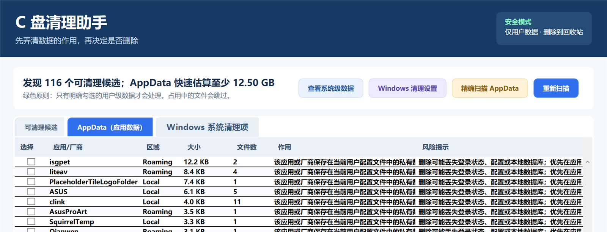

# C 盘清理助手

[](https://github.com/qinsss/windows-c-clear/actions/workflows/ci.yml)
[](https://github.com/qinsss/windows-c-clear/releases/latest)
[](LICENSE)


**先解释数据的作用，再由你决定是否删除。**

一个安全优先的 Windows C 盘清理工具，支持常规清理候选、AppData 占用分析与精确扫描。所有项目默认不勾选，明确选择后才会处理，删除默认进入回收站。

> Windows C Clear is an open-source, safety-first disk cleanup utility for Windows 10/11.



## 下载

| 平台 | 用途 | 地址 |
| --- | --- | --- |
| GitHub | 主仓库、Issue、自动构建和免安装版本 | [下载最新正式版](https://github.com/qinsss/windows-c-clear/releases/latest) |
| Gitee | 国内源码镜像和备用访问 | [访问 Gitee 仓库](https://gitee.com/qin_s/windows-c-clear) |

在 GitHub Release 中下载 `WindowsCClear-Portable.exe` 即可，无需安装，也不需要管理员权限。

程序目前没有商业代码签名证书，Windows 首次运行时可能显示 SmartScreen 提示。请确认下载地址来自上述仓库，并使用 Release 附带的 `SHA256SUMS.txt` 校验文件完整性。

## 为什么做这个工具

Windows 的“缓存”“临时文件”和 AppData 并不等于都可以安全删除。很多清理工具只展示一个容量数字，却没有解释数据由谁产生、删除后会发生什么。

C 盘清理助手把决定权留给用户：

- **系统级数据**：Windows、Program Files、ProgramData 等受保护位置只展示说明，不提供删除按钮。
- **用户级数据**：列出临时文件、浏览器缓存、崩溃转储、开发工具缓存及过期下载文件，并解释用途和影响。
- **AppData（应用数据）**：统计 `Local`、`LocalLow` 和 `Roaming` 下的应用/厂商目录，支持精确扫描和手动选择。
- **Windows 系统清理项**：解释更新缓存、WinSxS、Windows.old、驱动、休眠文件、还原点等数据的正确处理方式。

## 安全设计

- 所有项目默认不勾选，必须逐项确认。
- 系统目录经过硬性路径拦截，无法从界面直接删除。
- 删除默认送入 Windows 回收站，可以恢复。
- AppData 删除需要路径明细确认和第二次高风险确认。
- 同时选择父目录和子目录时会阻止执行，避免扩大删除范围。
- 正在使用或无法访问的文件会跳过。
- 扫描和删除不会跟随目录联接或符号链接。
- 缓存目录只清空内容，不删除应用所需的根目录。

详细的安全报告方式见 [SECURITY.md](SECURITY.md)。无论使用任何清理工具，重要数据都应提前备份。

## 主要功能

- 快速扫描：在隐藏后台进程中识别候选并显示 Loading。
- AppData 精确扫描：完整遍历并显示百分比、目录计数和当前位置。
- 数据用途说明：每项说明来源、作用、建议与删除影响。
- 双击定位：可以在资源管理器中核对实际位置，也可自行删除。
- 安全删除：只处理明确勾选项，默认移入回收站。
- 扩展识别：DirectX、错误报告、缩略图、最近记录和常见开发缓存。
- 系统清理引导：对于需要 Windows 自带功能处理的区域，提供说明和正确入口。

## 使用方法

1. 启动程序。首次打开只加载界面，不会自动扫描磁盘。
2. 点击“开始扫描”获取快速结果，或点击“精确扫描 AppData”进行完整统计。
3. 阅读每项的用途和删除影响；双击项目可以先打开实际目录。
4. 仅勾选确认不再需要的数据。
5. 点击“移到回收站”，核对路径并完成确认。

从源码运行时，可双击 `启动 C盘清理助手.cmd` 或 `Launch-WindowsCClear.vbs`，也可以执行：

```powershell
powershell.exe -NoProfile -ExecutionPolicy Bypass -File .\src\WindowsCClear.ps1
```

## 常见问题

### 为什么 Windows 属性显示 AppData 有 36 GB，快速扫描只显示 13 GB？

快速扫描是为了尽快给出结果的受限估算，会限制超大目录的遍历时间和文件数量，并可能跳过无权限目录、正在变化的数据、目录联接和符号链接。因此它显示的是“至少占用”，不等同于资源管理器完整递归统计。需要核对总量时请使用“精确扫描 AppData”。

### 为什么精确扫描仍可能和资源管理器有差异？

扫描期间应用可能持续写入缓存；部分目录可能没有访问权限；资源管理器还可能采用不同的磁盘占用、压缩文件或链接计算方式。工具不会绕过权限，也不会跟随目录联接。

### 为什么部分文件无法删除？

文件可能正被浏览器、钉钉、微信或其他程序使用。工具会跳过这些文件，而不是尝试强制关闭应用。关闭对应程序后可以重新扫描，也可以双击项目后在资源管理器中处理。

### AppData 可以全部删除吗？

不可以。AppData 可能包含登录状态、软件配置、本地数据库、聊天记录和未同步文件。工具允许勾选是为了让用户核对并处理明确不需要的应用数据，不代表所有目录都安全。

### 为什么 Windows 显示“已保护你的电脑”？

当前免安装程序没有商业代码签名证书，因此可能触发 SmartScreen。请只从本项目的 GitHub/Gitee 页面进入下载地址，并核对 SHA-256。源码、构建脚本和 CI 配置均公开可审查。

### 为什么不直接清理 WinSxS、DriverStore 或注册表？

这些区域需要由 Windows 服务、设置或系统工具维护，按文件名直接删除可能破坏更新、驱动或系统启动。本工具明确不直接删除 `Prefetch`、`WinSxS`、`DriverStore`、Windows Installer 缓存、分页文件、注册表和未知系统数据。

## 构建与测试

运行测试：

```powershell
powershell.exe -NoProfile -ExecutionPolicy Bypass -File .\tests\Smoke.Tests.ps1
```

生成单文件免安装程序：

```powershell
powershell.exe -NoProfile -ExecutionPolicy Bypass -File .\build-portable.ps1
```

输出文件为 `dist\C盘清理助手.exe`。程序运行时会在系统临时目录释放必要脚本，关闭后自动清理。

## 参与贡献

欢迎提交经过脱敏的 Bug 报告、应用数据识别规则和交互改进建议。涉及新清理规则时，必须同时说明数据用途、路径边界和删除风险。具体要求见 [CONTRIBUTING.md](CONTRIBUTING.md)。

## 开源许可

本项目采用 [MIT License](LICENSE)。
